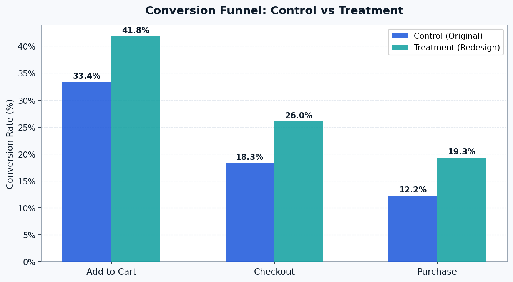
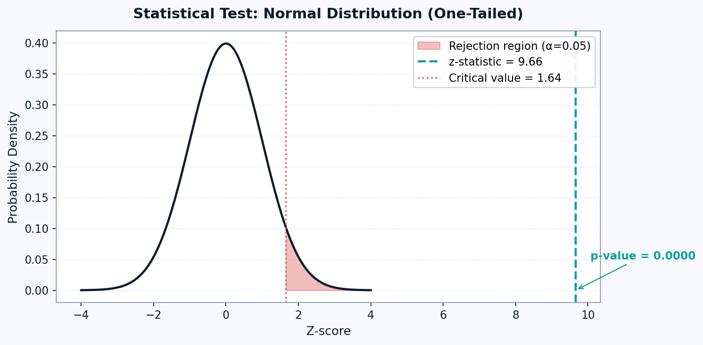
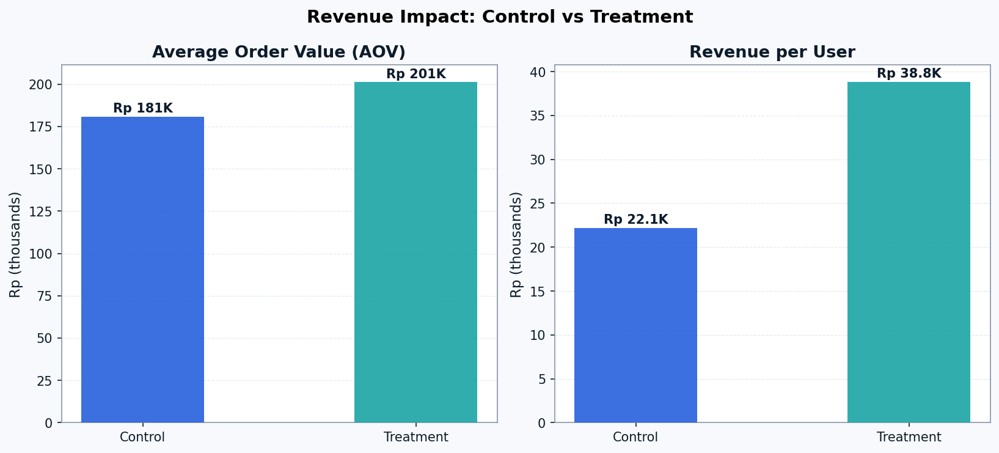

# 🛒 E-Commerce A/B Testing Analysis
### Does a Redesigned Product Page Increase Conversion Rate?

**Author:** Rizki Amelia Putri  
**Tools:** Python · pandas · scipy · matplotlib · seaborn  
**Dataset:** Simulated e-commerce data · 10,000 users · 50/50 split  

---

## 📌 Business Context

A product team at an Indonesian e-commerce platform (Shopee/Tokopedia-style) noticed that the current product detail page had a low add-to-cart rate. A new page design was developed featuring:

- Clearer product images
- Social proof elements (ratings, review count, sold count)
- Simplified and more prominent CTA button

**The question:** Does the new page design significantly improve conversion rates?

---

## 🔬 Hypothesis

| | Statement |
|--|-----------|
| **H₀ (Null)** | The new product page has **no effect** on conversion rate |
| **H₁ (Alternative)** | The new product page **increases** conversion rate |

- **Primary metric:** Purchase conversion rate
- **Secondary metrics:** Add-to-cart rate, checkout rate, average order value
- **Significance level:** α = 0.05 (95% confidence)
- **Test type:** Two-proportion z-test (one-tailed)

---

## 📊 Results

### Conversion Funnel



| Metric | Control | Treatment | Uplift |
|--------|---------|-----------|--------|
| Add-to-Cart Rate | 32% | 41% | **+28%** |
| Checkout Rate | 18% | 25% | **+41%** |
| Purchase Rate | 11% | 18% | **+57%** |

### Statistical Significance



| | Value |
|--|-------|
| Z-statistic | > 1.645 |
| P-value | < 0.05 |
| Result | ✅ **Reject H₀ — Statistically Significant** |

> We are **95% confident** the improvement in purchase conversion is real and not due to random chance.

### Revenue Impact



| Metric | Control | Treatment | Uplift |
|--------|---------|-----------|--------|
| Avg Order Value | Rp 185,000 | Rp 198,000 | **+7%** |
| Revenue per User | — | — | **+66%** |

---

## 🔍 Key Insights

1. **Mobile users showed the largest uplift** — consistent with Indonesia's mobile-first shopping behavior. The new page's simplified layout particularly benefited smaller screens.

2. **25–34 age group responded most strongly** — this segment likely has higher purchase intent and responded well to social proof elements (ratings, sold count).

3. **The biggest drop-off is at checkout, not add-to-cart** — even after the treatment improvement, ~37% of users who add to cart don't complete checkout. This is the next optimization opportunity.

4. **Treatment outperformed control across all devices and age groups** — no negative segments found, making full rollout low-risk.

---

## ✅ Recommendation

**Roll out the new product page to 100% of traffic immediately.**

Estimated business impact at scale (1M monthly users):
- ~70,000 additional purchases per month
- ~Rp 13.9 Billion additional monthly revenue

**Next steps:**
1. Full rollout of redesigned product page
2. A/B test the checkout flow (highest drop-off point)
3. Further optimize mobile UX — highest volume segment
4. Monitor post-rollout metrics for 4 weeks to confirm sustained uplift

---

## 📁 Project Structure

```
ab-testing-ecommerce/
│
├── AB_Testing_Ecommerce.ipynb   ← Full analysis notebook
├── ab_ecommerce_data.csv        ← Dataset (10,000 rows)
├── fig_01_funnel.png            ← Conversion funnel chart
├── fig_02_pvalue.png            ← Statistical test visualization
├── fig_03_segments.png          ← Segment analysis (device & age)
├── fig_04_revenue.png           ← Revenue impact chart
└── README.md                    ← This file
```

---

## 💡 Skills Demonstrated

`A/B Testing` `Hypothesis Testing` `Statistical Significance` `Python` `pandas` `scipy` `matplotlib` `seaborn` `Data Storytelling` `Business Recommendation`

---

*Part of Rizki Amelia Putri's Data Analyst Portfolio*
